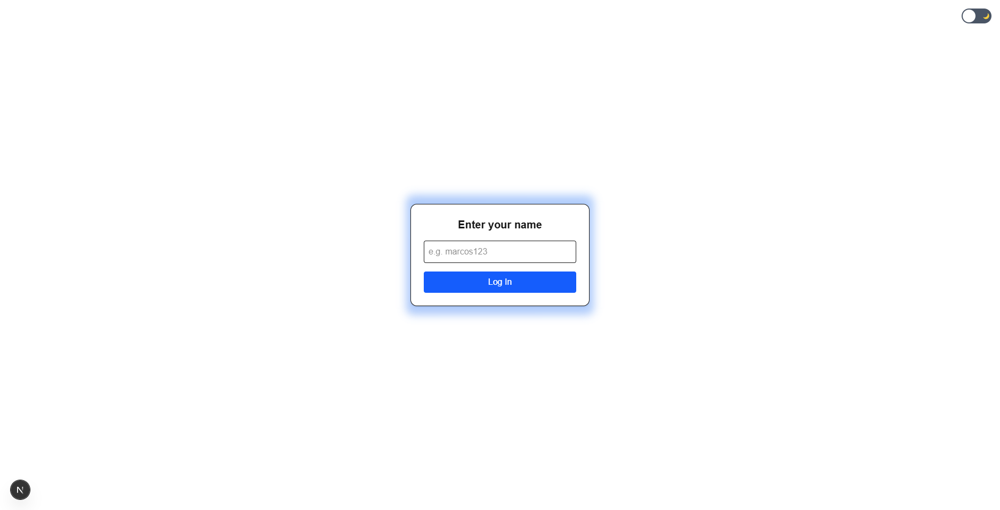
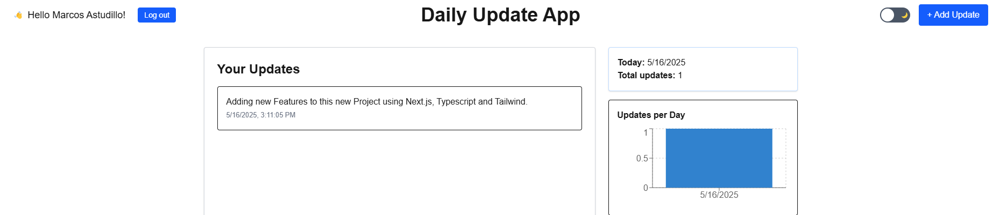
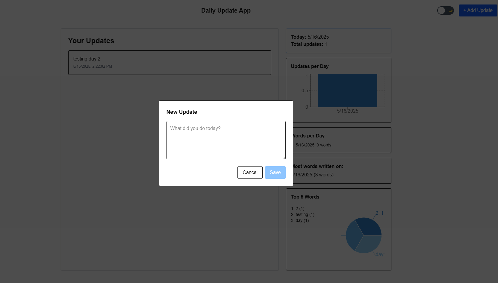
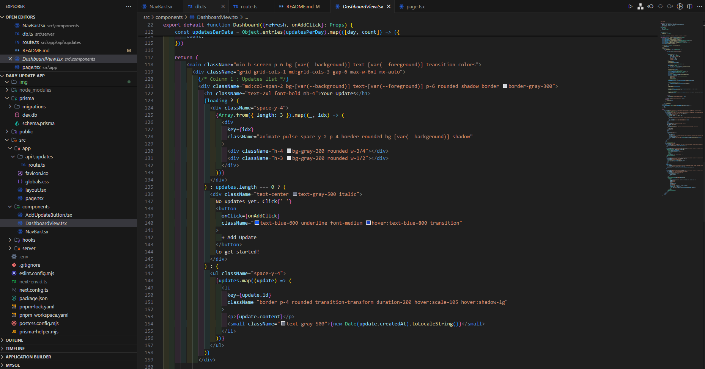
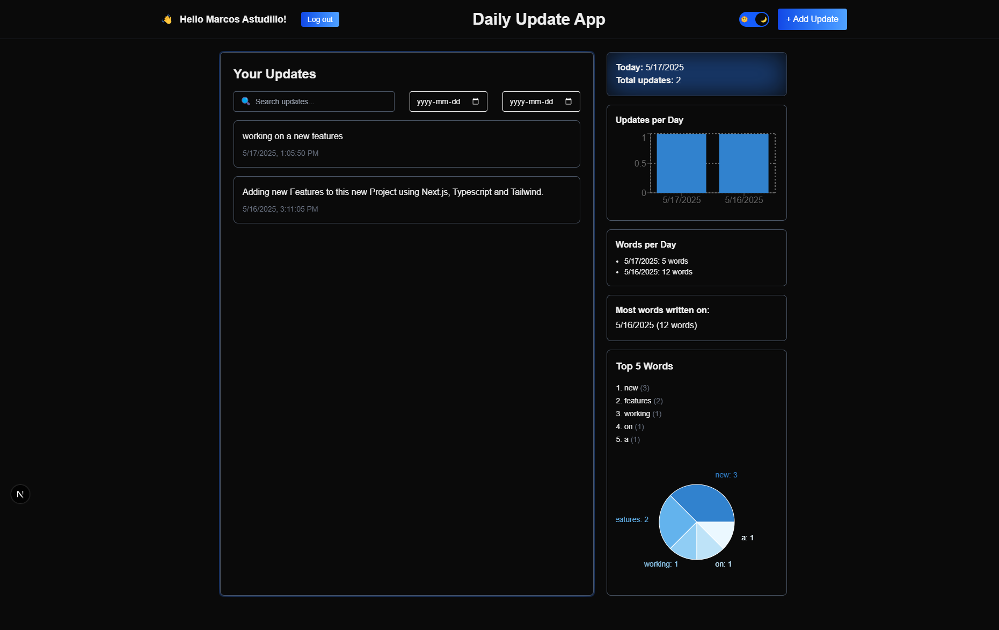
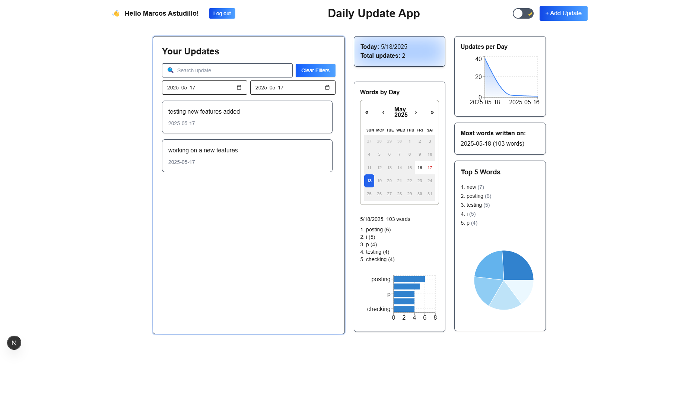
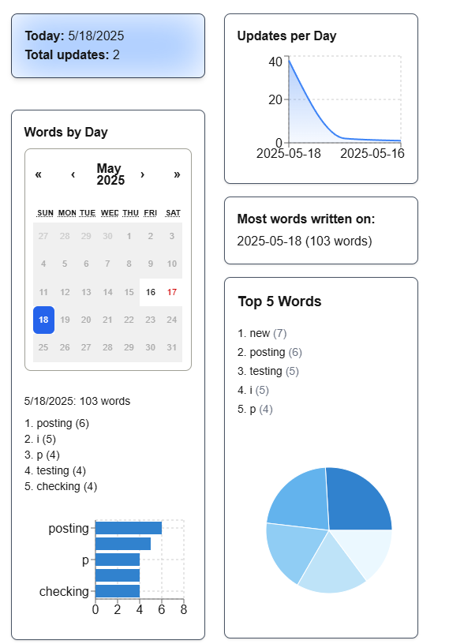

# Daily Update App

A full-stack internal tool where users can submit daily updates, built with the T3 Stack (Next.js, TypeScript, Prisma).

## ✨ Features

- ✅ Submit daily updates via a simple form
- ✅ Dashboard with all previous updates
- ✅ Simulated login with dynamic user ID
- ✅ Logout support
- ✅ Filter updates by user ID
- ✅ Dark/light theme toggle
- ✅ Analytics: updates per day, total count, top words
+ - ✅ Date range filtering for updates
+ - ✅ Search updates by content
+ - ✅ Calendar-based word tracking per day
+ - ✅ Clear filters button with elegant UI
+ - ✅ Infinite scrolling (when no filters applied)


## 🚀 Tech Stack

- Next.js 15 (App Router)
- Tailwind CSS 4 (with custom dark mode)
- TypeScript
- Prisma + SQLite
- Recharts for data visualization

## 📦 Setup

```bash
pnpm install
pnpm exec prisma migrate dev --name init
pnpm dev
```

## 🔍 Demo Instructions

1. Run the app: `pnpm dev`
2. Enter any name to simulate login.
3. Submit updates via the "+ Add Update" button.
4. Try searching or filtering updates by date.
5. Explore the analytics on the right side!


## 🖼 Screenshots

| Login Screen | Navbar with User |
|--------------|------------------|
|  |  |

| Update Form | Form Code |
|-------------|------------|
|  |  |

| Dashboard (Light) | Dashboard (Dark) |
|-------------------|------------------|
|  |  |

| Date Filter & Search | Words by Day |
|----------------------|---------------|
|  |  |

## 🔐 Auth Simulation

A lightweight login form asks the user for their name, which is saved in localStorage. All updates are filtered per user ID. Users can log out and switch users at any time.

## 📁 Folder Structure

- `/src/app`: App Router structure
- `/src/components`: Reusable components
+ - `/src/components/DashboardView.tsx`: Main dashboard logic and rendering
+ - `/src/context/AuthContext.tsx`: Simulated auth logic
- `/src/hooks`: Custom React hooks (e.g., `useDarkMode` for theme toggling)
- `/src/app/api/updates/route.ts`: API route for creating and retrieving updates using Prisma
- `/src/server/db.ts`: Prisma client instance
- `/prisma/schema.prisma`: Prisma DB schema
- `/img`: Screenshots for README

## 🧪 Testing

The component `DashboardView` now includes a dedicated test file for filter behavior:
- `DashboardView.test.tsx`: Basic render and search filter tests.
- `DashboardView.filters.test.tsx`: Specific tests for date range filtering and combined search/date filtering.
- `Navbar.test.tsx`: Tests for the navbar component.

These tests ensure updates are rendered and filtered correctly based on user input.

## 📜 Version History

### v2.2.0 (May 19, 2025)
- ♻️ **Component refactoring**
  - Introduced reusable `PrimaryButton` component for consistent button styles
  - Extracted `ThemeToggle` into a standalone component
  - Extracted `AppHeaderTitle` into a dedicated component
  - Simplified and cleaned up `NavBar` by using the new reusable components
- ✅ Confirmed all existing tests pass
- ✅ Improved structure and readability of UI logic

### v2.1.0 (May 19, 2025)
- ✅ Separated date filtering logic into isolated test file
- ✅ Added tests for:
  - Filtering updates by date range
  - Combining search and date filters
  - Navigation bar (NavBar) component behavior
- ✅ Improved test structure and reliability for `DashboardView`
- ✅ Minor structural refinements in testing logic

### v2.0.0 (May 18, 2025)
- ✅ Refactored dashboard to support **date range filtering**
- ✅ Added **search bar** for content filtering
- ✅ Built "**Words by Day**" calendar widget
- ✅ Created "**Clear Filters**" button with polished UI
- ✅ Enabled **infinite scrolling** when no filters are applied
- ✅ Fixed filtering logic to properly combine date + search
- ✅ Visual adjustments and layout improvements

### v1.1.0
- ✅ Added analytics widgets:
  - Updates per day (area chart)
  - Top 5 words (pie chart)
  - Most verbose day
- ✅ Visual polish: transitions, hover states, shadows

### v1.0.0
- ✅ Core app logic
- ✅ Submit updates with user simulation
- ✅ View update history
- ✅ Dark/light theme with localStorage persistence


## 📝 License

This project is licensed under the [MIT License](./LICENSE) © 2025 Marcos Astudillo

