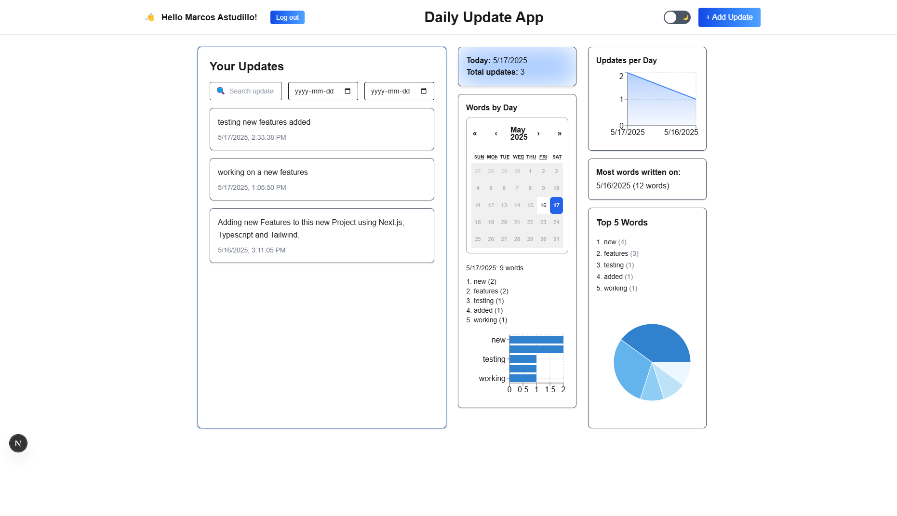

# Daily Update App

A full-stack internal tool where users can submit daily updates, built with the T3 Stack (Next.js, TypeScript, Prisma).

## ✨ Features

- ✅ Submit daily updates via a simple form
- ✅ Dashboard with all previous updates
- ✅ Simulated authentication (hardcoded user ID)
- ✅ Dark/light theme toggle
- ✅ Analytics: updates per day, total count, top words

## 🚀 Tech Stack

- Next.js 15 (App Router)
- Tailwind CSS 4 (with custom dark mode)
- TypeScript
- Prisma + SQLite
- Recharts for data visualization

## 📦 Setup

```bash
pnpm install
pnpm exec prisma migrate dev --name init
pnpm dev
```

## 🖼 Screenshots

| Update Form | Form Code |
|-------------|------------|
|  |  |

| Dashboard (Light) | Dashboard (Dark) |
|-------------------|------------------|
|  |  |

## 🔐 Auth Simulation

A hardcoded user ID (`demo-user`) is used for saving and filtering updates.

## 📁 Folder Structure

- `/src/app`: App Router structure
- `/src/components`: Reusable components
- `/src/hooks`: Custom React hooks (e.g., `useDarkMode` for theme toggling)
- `/src/app/api/updates/route.ts`: API route for creating and retrieving updates using Prisma
- `/src/server/db.ts`: Prisma client instance
- `/prisma/schema.prisma`: Prisma DB schema
- `/img`: Screenshots for README

## 📝 License

This project is licensed under the [MIT License](./LICENSE) © 2025 Marcos Astudillo

