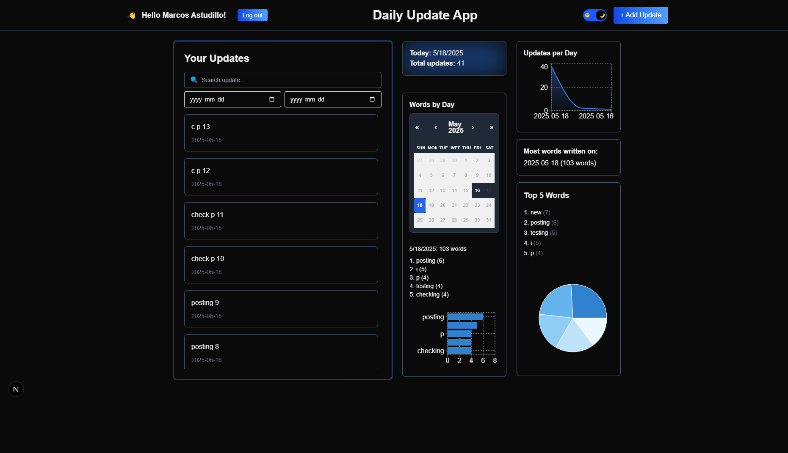

# Daily Update App

Daily Update App is a Full-Stack internal tool that helps individuals or teams track and reflect on their daily progress. Submit your daily logs, review historical updates, and gain insight with analytics like word trends and update volume — all in a clean and responsive dashboard.

Built with the T3 Stack (Next.js, TypeScript, Prisma).

## ✨ Features

- ✅ Submit daily updates via a simple form
- ✅ Dashboard with all previous updates
- ✅ Simulated login with dynamic user ID
- ✅ Logout support
- ✅ Filter updates by user ID
- ✅ Dark/light theme toggle
- ✅ Analytics: updates per day, total count, top words
  - ✅ Date range filtering for updates
  - ✅ Search updates by content
  - ✅ Calendar-based word tracking per day
  - ✅ Clear filters button with elegant UI
  - ✅ Infinite scrolling (when no filters applied)
- ✅ **Refactored UI components**:
  - Introduced reusable `PrimaryButton`, `ThemeToggle`, `AppHeaderTitle` for better UI consistency.
  - Extracted `NavBar`, `WordStatsByDay`, `UpdatesList`, and `UpdateItem` into reusable components.
  - **Refined Dashboard structure**: Cleaned up logic and made it more modular.
- ✅ Improved **layout** for better readability and organization in the Dashboard view.
- ✅ **Footer component** added with links to personal portfolio, GitHub, LinkedIn, etc.
- ✅ **Added footer information**: Added rights, technologies used, and social media links to the footer.
- ✅ **Automated testing workflow**:
  - GitHub Actions CI runs tests on every push and pull request.
  - Ensures test coverage and code stability using `Vitest` and `pnpm`.

## 🚀 Tech Stack

- Next.js 15 (App Router)
- Tailwind CSS 4 (with custom dark mode)
- TypeScript
- Prisma + SQLite
- Recharts for data visualization

## 📦 Setup

```bash
pnpm install
pnpm exec prisma migrate dev --name init
pnpm dev
```

## 🔍 Demo Instructions

1. Run the app: `pnpm dev`
2. Enter any name to simulate login.
3. Submit updates via the "+ Add Update" button.
4. Try searching or filtering updates by date.
5. Explore the analytics on the right side!


## 🖼 Screenshots

| Login Screen | Navbar with User |
|--------------|------------------|
|  |  |

| Update Form | Form Code |
|-------------|------------|
|  |  |

| Dashboard (Light) | Dashboard (Dark) |
|-------------------|------------------|
|  |  |

| Date Filter & Search | Words by Day |
|----------------------|---------------|
|  |  |

## 🔐 Auth Simulation

A lightweight login form asks the user for their name, which is saved in localStorage. All updates are filtered per user ID. Users can log out and switch users at any time.

## 📁 Folder Structure

- `/src/app`: App Router structure
- `/src/components`: Reusable components
+ - `/src/components/DashboardView.tsx`: Main dashboard logic and rendering
+ - `/src/context/AuthContext.tsx`: Simulated auth logic
- `/src/hooks`: Custom React hooks (e.g., `useDarkMode` for theme toggling)
- `/src/app/api/updates/route.ts`: API route for creating and retrieving updates using Prisma
- `/src/server/db.ts`: Prisma client instance
- `/prisma/schema.prisma`: Prisma DB schema
- `/img`: Screenshots for README

## 🧪 Testing

This project includes a complete test suite using **Vitest** and **React Testing Library**.

### Coverage includes:

- `NavBar`: displays user, logout, title, theme toggle
- `DashboardView`: full integration, rendering, filter logic
- `LoginScreen`: form validation and input
- `UpdatesList` & `UpdateItem`: update rendering, structure
- `UpdateFilters`: interaction testing (search, date)
- `AddUpdateButton`: button behavior and icon
- `PrimaryButton`: reusable button styling
- `ThemeToggle`: dark/light theme logic
- `SummaryCard`: displays total word count
- `TopWordsPanel`: pie chart for top words
- `MostVerboseDay`: day with highest word count
- `WordStatsByDay`: calendar-based word stats
- `UpdatesPerDayChart`: area chart with tooltip rendering

### Run tests

```bash
pnpm vitest
```

### Run tests in watch mode

```bash
pnpm vitest dev
```

## 🛠 Continuous Integration (CI)

This project uses **GitHub Actions** to run all Vitest tests on every push and pull request to the `main` branch. It ensures code quality and prevents regressions automatically.

Workflow: `.github/workflows/ci.yml`

## 📜 Version History

### v2.3.1 (May 21, 2025)
- 🧪 **Full test coverage** using Vitest and Testing Library:
  - Added tests for all major components including: `NavBar`, `LoginScreen`, `UpdatesList`, `UpdateItem`, `ThemeToggle`, `TopWordsPanel`, `WordStatsByDay`, and more.
  - Created `DashboardView.integration.test.tsx` and `DashboardView.smoke.test.tsx` for full render validation.
- ♻️ Refactored test structure into `__tests__` folder.
- ✅ Improved `AuthContext` and `useDarkMode` mocks for consistent rendering.
- 🐞 Fixed multiple failing test cases (e.g., `NavBar`, `Log out` button, dark/light icons).
- ✅ Improved test reliability by addressing async rendering issues and DOM role errors.

### v2.3.0 (May 19, 2025)
- ♻️ **Component refactoring**:
  - Refactored `DashboardView` with separate logic for updates and filtering into isolated components.
  - Modularized and improved code with reusable components:
    - `PrimaryButton` for consistent button styling.
    - `ThemeToggle` for dark/light mode toggling.
    - `AppHeaderTitle` for standardized header titles.
    - `UpdateList` and `UpdateItem` for modular update list rendering.
- ✅ **Footer added** with links to GitHub, LinkedIn, Portfolio, and more.
- ✅ Improved **scroll behavior** by making the footer responsive and hiding it when not in use.

### v2.2.0 (May 19, 2025)
- ♻️ **Component refactoring**:
  - Introduced reusable `PrimaryButton` component for consistent button styles.
  - Extracted `ThemeToggle` into a standalone component.
  - Extracted `AppHeaderTitle` into a dedicated component.
  - Simplified and cleaned up `NavBar` by using the new reusable components.
- ✅ Confirmed all existing tests pass.
- ✅ Improved structure and readability of UI logic.
- ✅ Refactored dashboard update list into:
  - `UpdatesList`: handles update list rendering.
  - `UpdateItem`: handles individual update item.
- ✅ Improved separation of concerns for better readability and testability.


### v2.1.0 (May 19, 2025)
- ✅ Separated date filtering logic into isolated test file
- ✅ Added tests for:
  - Filtering updates by date range
  - Combining search and date filters
  - Navigation bar (NavBar) component behavior
- ✅ Improved test structure and reliability for `DashboardView`
- ✅ Minor structural refinements in testing logic

### v2.0.0 (May 18, 2025)
- ✅ Refactored dashboard to support **date range filtering**
- ✅ Added **search bar** for content filtering
- ✅ Built "**Words by Day**" calendar widget
- ✅ Created "**Clear Filters**" button with polished UI
- ✅ Enabled **infinite scrolling** when no filters are applied
- ✅ Fixed filtering logic to properly combine date + search
- ✅ Visual adjustments and layout improvements

### v1.1.0
- ✅ Added analytics widgets:
  - Updates per day (area chart)
  - Top 5 words (pie chart)
  - Most verbose day
- ✅ Visual polish: transitions, hover states, shadows

### v1.0.0
- ✅ Core app logic
- ✅ Submit updates with user simulation
- ✅ View update history
- ✅ Dark/light theme with localStorage persistence


## 📝 License

This project is licensed under the [MIT License](./LICENSE) © 2025 Marcos Astudillo

